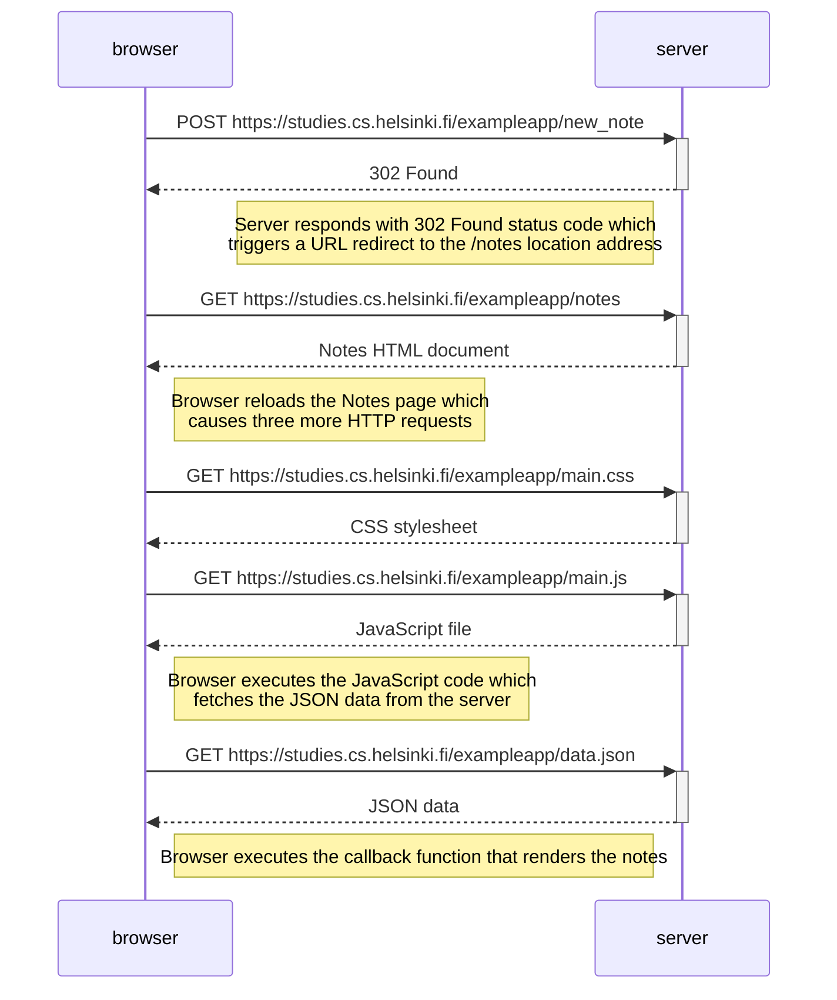

```mermaid
    sequenceDiagram
      participant browser
      participant server

      browser->>+server: POST https://studies.cs.helsinki.fi/exampleapp/new_note
      server-->>-browser: 302 Found
      Note left of server: Server responds with 302 Found status code which<br/>triggers a URL redirect to the /notes location address

      browser->>+server: GET https://studies.cs.helsinki.fi/exampleapp/notes
      server-->>-browser: Notes HTML document
      Note right of browser: Browser reloads the Notes page which<br/>causes three more HTTP requests

      browser->>+server: GET https://studies.cs.helsinki.fi/exampleapp/main.css
      server-->>-browser: CSS stylesheet

      browser->>+server: GET https://studies.cs.helsinki.fi/exampleapp/main.js
      server-->>-browser: JavaScript file
      Note right of browser: Browser executes the JavaScript code which<br/> fetches the JSON data from the server

      browser->>+server: GET https://studies.cs.helsinki.fi/exampleapp/data.json
      server-->>-browser: JSON data
      Note right of browser: Browser executes the callback function that renders the notes
```