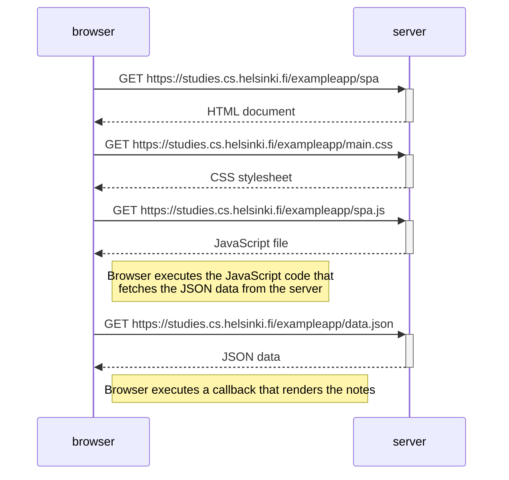

```mermaid
    sequenceDiagram
      participant browser
      participant server

      browser->>+server: GET https://studies.cs.helsinki.fi/exampleapp/spa
      server-->>-browser: HTML document

      browser->>+server: GET https://studies.cs.helsinki.fi/exampleapp/main.css
      server-->>-browser: CSS stylesheet

      browser->>+server: GET https://studies.cs.helsinki.fi/exampleapp/spa.js
      server-->>-browser: JavaScript file
      Note right of browser: Browser executes the JavaScript code that<br/>fetches the JSON data from the server

      browser->>+server: GET https://studies.cs.helsinki.fi/exampleapp/data.json
      server-->>-browser: JSON data
      Note right of browser: Browser executes a callback that renders the notes
```